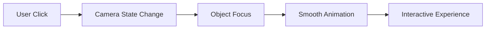
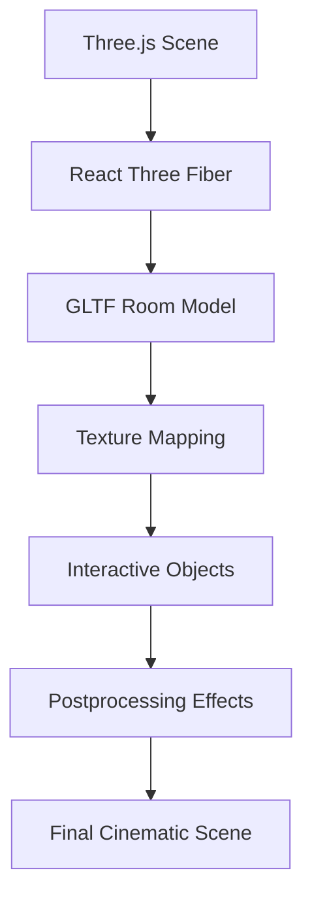

<div align="center">


<br/>


<br/><br/>


<br/><br/>

# ✦ Cinematic 3D Portfolio ✦

### Premium Interactive Developer Portfolio built with Three.js, React & Immersive Web Technologies

<br/>

<p align="center">

<a href="https://react.dev/">

</a>

<a href="https://vitejs.dev/">

</a>

<a href="https://threejs.org/">

</a>

<a href="https://docs.pmnd.rs/react-three-fiber/getting-started/introduction">

</a>

<a href="https://github.com/pmndrs/drei">

</a>

<a href="https://developer.mozilla.org/en-US/docs/Web/CSS">

</a>

<a href="https://vercel.com/">

</a>

</p>

<br/>

> A premium cinematic 3D developer portfolio designed to create an immersive recruiter experience through interactive environments, smooth animations, realistic aesthetics, and creative storytelling.

</div>

---

# 📚 Table of Contents

1. Project Overview  
2. Features  
3. Interactive Experience  
4. Technical Stack  
5. Project Structure  
6. 3D Rendering System  
7. Performance Optimization  
8. Installation & Setup  
9. Assets & Texture System  
10. Deployment  
11. Future Improvements  
12. Author  

---

# 1. 🚀 Project Overview

This project is a fully immersive cinematic 3D portfolio room built using modern frontend technologies and real-time 3D rendering systems.

Unlike traditional portfolios, this experience allows visitors and recruiters to explore an interactive virtual workspace containing:

- Interactive desktop portfolio
- Smartphone portfolio emulator
- Realistic 3D room environment
- Vision board aesthetics
- Interactive lighting system
- Dynamic camera transitions
- Functional music display
- Immersive storytelling UI

The project combines creativity, engineering, and immersive web technologies to create a memorable portfolio experience.

---

# 2. ✨ Features

## 🎥 Cinematic 3D Environment

- Fully interactive 3D room
- Smooth cinematic camera movement
- Real-time rendering
- Interactive object focus system
- Hover interactions
- Dynamic transitions

---

## 🖥️ Interactive Screens

The room contains multiple interactive displays:

| Display | Functionality |
|---|---|
| Desktop Monitor | Main Portfolio |
| Smartphone Screen | Mobile Portfolio |
| Laptop Display | Spotify-inspired Music UI |
| TV Emulator | Interactive Entertainment |

---

## 🌸 Vision Board Aesthetic

Custom productivity & motivation board featuring:

- Positive mindset visuals
- Motivational quotes
- Nature aesthetics
- Cozy productivity vibe
- Feminine minimal aesthetics
- Growth-oriented atmosphere

---

## ⚡ Smooth User Experience

- Interactive camera transitions
- Object selection system
- Optimized texture loading
- Responsive interactions
- Lightweight rendering pipeline

---

# 3. 🧠 Interactive Experience

## Camera Interaction Flow



---

## Interactive Navigation

Visitors can:

```text
• Zoom into desktop portfolio
• Explore mobile portfolio
• Interact with room displays
• Navigate cinematic environment
• Experience immersive storytelling
```

---

# 4. ⚙️ Technical Stack

## Frontend

- React.js
- Vite
- JavaScript (ES6+)
- CSS3

---

## 3D Rendering

- Three.js
- React Three Fiber
- Drei
- React Postprocessing

---

## Effects & Interactions

- Bloom Effects
- Outline Effects
- Hover Detection
- Camera Interpolation
- Texture Mapping
- UV Baked Textures

---

## Deployment

- Vercel

---

# 5. 📁 Project Structure

```bash
3D_Room_Portfolio/
├── README.md
├── index.html
├── package-lock.json
├── package.json
├── vite.config.js
│
├── public/
│   ├── IqraFatima.ico
│   ├── roomfinalss1.png
│   │
│   └── assets/
│       ├── RoomModel.glb
│       ├── SpotifyClone.webp
│       ├── SuperMarioAdvance4.gba
│       ├── bakeFrameDaycmp.webp
│       ├── bakeFrameLightMapcmp.webp
│       ├── bakeFrameNightcmp.webp
│       ├── bakedTextureDaycmp.webp
│       ├── boardBakedDcmp.webp
│       ├── boardBakedLMAPcmp.webp
│       ├── boardBakedNcmp.webp
│       ├── chairtopDraco.glb
│       ├── clock.glb
│       ├── desktopWallpaper.mp4
│       ├── marioWallpaper.mp4
│       ├── roomTextureLightMapcmp.webp
│       ├── roomTextureNightcmp.webp
│       ├── smartphoneWallpaper.webp
│       │
│       └── laptopDisp/
│           ├── AutumnPaus.jpg
│           ├── AutumnPlay.jpg
│           ├── christmasLightPaus.jpg
│           ├── christmasLightPlay.jpg
│           ├── clarityPaus.jpg
│           ├── clarityPlay.jpg
│           ├── comeAndGetYourLovePause.jpg
│           ├── comeAndGetYourLovePlay.jpg
│           ├── sunflowerPaus.jpg
│           ├── sunflowerPlay.jpg
│           │
│           └── audio/
│               ├── AutumnLeavesCover.mp3
│               ├── ChristmasLights.mp3
│               ├── Clarity.mp3
│               ├── ComeAndGetYourLove.mp3
│               └── Sunflower.mp3
│
├── src/
│   ├── main.jsx
│   ├── Experience.jsx
│   ├── style.css
│   │
│   ├── CameraManager/
│   │   └── CameraManager.jsx
│   │
│   ├── helper/
│   │   └── CameraStore.jsx
│   │
│   ├── Switch/
│   │   └── TheamSwitch.jsx
│   │
│   └── RoomModel/
│       ├── DispFrame.jsx
│       ├── Windows.jsx
│       ├── clock.jsx
│       ├── dispItem.jsx
│       ├── laptopDisp.jsx
│       ├── photoFrame.jsx
│       ├── roomModel.jsx
│       │
│       ├── iframes/
│       │   ├── desktopiFrame.jsx
│       │   ├── smartphoneiFrame.jsx
│       │   └── tvEmulator.jsx
│       │
│       ├── textures/
│       │   └── TextureMaterial.jsx
│       │
│       └── shaders/
│           ├── Room/
│           │   ├── fragment.glsl
│           │   └── vertex.glsl
│           │
│           └── partials/
│               ├── blend.glsl
│               └── perlin2d.glsl
```

---

# 6. 🎮 3D Rendering System

## Rendering Pipeline



---

## Postprocessing Effects

- Bloom Lighting
- Outline Highlights
- Interactive Glow Effects
- Realistic Depth Rendering

---

# 7. ⚡ Performance Optimization

The portfolio is optimized for smooth rendering and lightweight deployment.

## Optimizations Used

```text
• Optimized GLB Models
• Texture Compression
• Suspense Loading
• Lightweight Shaders
• Efficient Camera Handling
• Texture Preloading
• UV Baked Texture Workflow
• Optimized Rendering Pipeline
```

---

# 8. 💻 Installation & Setup

## Clone Repository

```bash
git clone https://github.com/Iqra-Fatima-07/3D_Room_Portfolio.git

cd 3D_Room_Portfolio
```

---

## Install Dependencies

```bash
npm install
```

---

## Start Development Server

```bash
npm run dev
```

---

## Production Build

```bash
npm run build
```

---

# 9. 🖼️ Assets & Texture System

## Texture Categories

| Asset Type | Purpose |
|---|---|
| Baked Textures | Room Lighting & Environment |
| Board Textures | Vision Board Visuals |
| Frame Textures | Shelf Photo Frames |
| Wallpapers | Idle Display Screens |
| GLB Models | 3D Objects & Room Models |

---

## Interactive Components

| Component | Description |
|---|---|
| DesktopiFrame | Main Portfolio Display |
| SmartphoneiFrame | Mobile Portfolio |
| TvEmulator | TV Interaction System |
| LaptopDisp | Music Display System |
| CameraManager | Camera Control Logic |

---

# 10. 🚀 Deployment

## Hosting Platform

- Vercel

---

## Build Command

```bash
npm run build
```

---

## Output Directory

```bash
dist
```

---

# 11. 🔮 Future Improvements

- AI assistant integration
- Dynamic weather system
- Voice interaction support
- Multiplayer room exploration
- Interactive mini games
- Advanced shader effects
- Real-time particle systems

---

# 12. 👩‍💻 Author

## Iqra Fatima

AI Engineer • Full Stack Developer • Creative Technologist

### Connect With Me

```text
GitHub   : https://github.com/Iqra-Fatima-07
LinkedIn : https://linkedin.com/in/iqra-fatima007
Portfolio: 
```

---

<div align="center">

### ⭐ If you found this project interesting, consider starring the repository!
<p align="center">
Built with ❤️ by <strong>Iqra Fatima</strong>
</p>

<br/>


</div>
````
